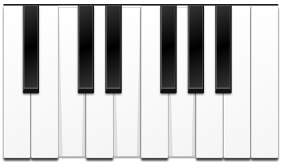

# Beautiful Piano

[](./piano.png)


[](https://www.npmjs.com/package/beautiful-piano)
[](https://david-dm.org/MusicJS/beautiful-piano)
[](https://david-dm.org/MusicJS/beautiful-piano#info=devDependencies)

This library provides a JavaScript API to generate HTML markup for a
beautiful musical keyboard. It comes with a CSS file which makes it so nice.

### Demo

See the demo on [rawgit](https://rawgit.com/MusicJS/beautiful-piano/master/demo/index.html)

## Setup
Either embed the file from the `dist` directory via script tag in your HTML:

```
<script src="beautiful-piano/dist/piano.js"></script>
```

Then you can access to the global variable `piano`.

Otherwise install it via npm `npm i beautiful-piano`

Don't forget to include the CSS file, for instance:

```
<link rel="stylesheet" href="beautiful-piano/styles.css">
```

## Usage

```
piano(document.querySelector('body'), {octaves: 3});
```

### piano(parent, options)

__Arguments:__
- `parent` - DOM element where to inject the piano
- `options` Options object, `octaves` and `range` property can't be used in combination
You can also pass a `namesMode` property.  
	- `octaves` - A positive integer, the amount of octaves to generate,
	starts always with an __A__ and ends with a __C__, min: 1, max: 9
	- `range` - Options object with a custom range
		- `startKey` - A string, key where the piano should start, `A-H`
		- `startOctave` - An integer on which octave the piano should start, min: 0, max: 10
		- `endKey` - A string, key where the piano should end, `A-H`
		- `endOctave` - An integer on which octave the piano should end, min: 0, max: 10
	- `namesMode` - A string, either `sharp` or `flat` when names for the black keys are shown
	- `nameOctaves` - A boolean, `false` means octave names will not be printed on the keyboard. 
	- `lang` - A string, either `en` or `de` to swap __H__ and __B__
	- `notation` - A string, either `scientific` or `helmholz` will be used for octave notation
	- `onKeyClick` - A callback function
	- `onKeyDown` - A callback function
	- `onKeyUp` - A callback function

### Selectors

You can toggle the pressed effect of each key with CSS class.
For instance: `document.querySelector('.C4').classList.add('active')`

The selector for the keys use the scientific notatino for the octave.
All 12 keys for the fourth octave can be accessed with these selectors:


```css
.C4 { }
/* note, that .Cs4 and .Db4 will select the same object */
.Cs4, .Db4 { }
.D4 { }
.Ds4, .Eb4 { }
.E4 { }
.F4 { }
.Fs4, .Gb4 { }
.G4 { }
.Gs4, .Ab4 { }
.A4 { }
.As4, .Bb { }
.B  { } 
```

You can also select keys by their color and by their octave:

```css
/* Select all white keys */
.white {}

/* Select all black keys for octave 3*/
.oct3 .black {}
```

## Event Handling

If you pass in callback functions for `onKeyClick`, `onKeyDown` or `onKeyUp` you will be able to hook into the function and detect when keys are pressed:

``` js
/**
 * Handle the click
 * @param {string} key
 */
function keyClickHandler(key) {
	console.log('CLICK', key); 
	// outputs: "CLICK A#3", "CLICK C3" etc...
}

piano(document.querySelector('body'), {octaves: 3, onKeyClick});

```

## WTF? I can't hear anything!

This library provides just a visual interface.
Playing a sound while pressing a key is comming soon as an extra module.


## Credits
All visual credits goes to [Taufik Nurrohman](https://github.com/tovic)

I started with the style sheets from his codepen and modified it for more dynamic
use cases.
